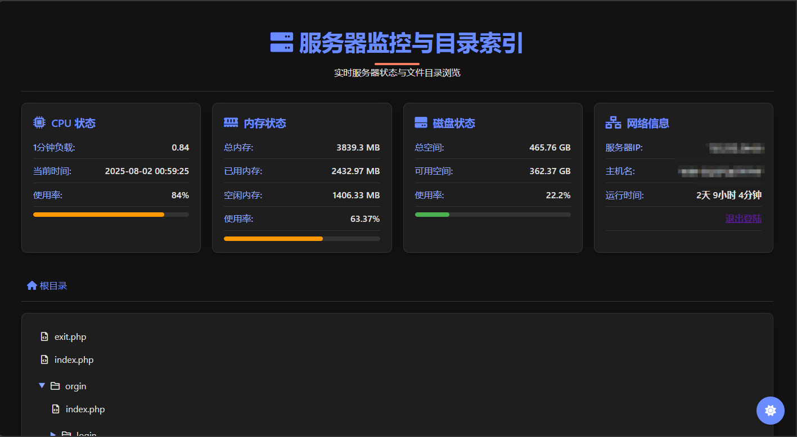

# DirVuln
Directory Navigator & Common Vuln Playground
**目录导航与常见漏洞靶场**

## 项目功能
- 服务器监控与目录索引页面 (index.php)
- 集成漏洞测试环境 (位于/Vulnweb目录)

## 使用说明
1. 直接克隆即可运行
2. 推荐使用 PHP ≤ 7.4 版本 (最佳兼容性)

*由 DeepSeek 提供技术支持*
## 安全提示
⚠️ `index.php` 未经完整安全审计，可能存在未发现漏洞  
🔒 **严禁在生产环境部署使用**
## 后续计划
📚 项目使用笔记与详细文档将陆续公开
按小键盘"."可以直接用GitHub的dev部署。
[索引页面截图]

# DirVuln  
**Directory Navigator & Common Vulnerability Playground**

## Features
- Server monitoring and directory index page (index.php)
- Integrated vulnerability testing environment (located in /Vulnweb)

## Quick Start
1. Clone and run directly
2. Recommended PHP version ≤ 7.4 (optimal compatibility)

*Powered by DeepSeek*
## Security Notice
⚠️ `index.php` has not been fully audited - may contain undiscovered vulnerabilities  
🔒 **NOT SAFE for production deployment**
## Roadmap
📚 Usage notes and documentation will be published
[索引页面截图]

